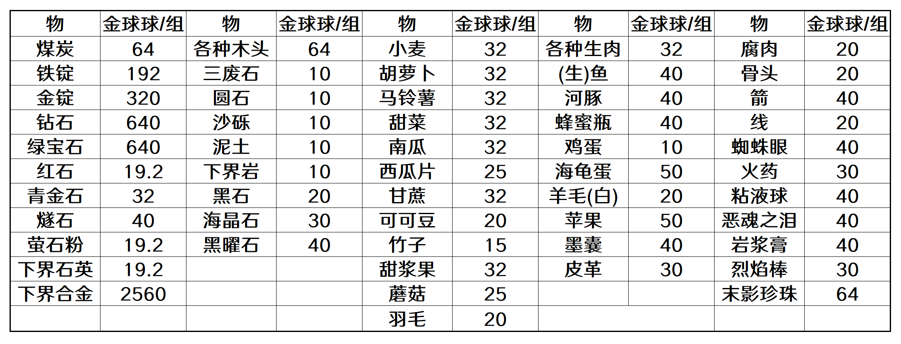

# FAQ
-----
这个目录是关于服务器玩法的相关信息指导。包括商店价格、世界的基本规则、怎么圈地，等等。

## 0、服务器规则规定
1. 主世界、末地、下界允许圈地、资源收集等基本操作，血月世界、暮色森林不允许圈地。
2. 暮色森林的某些物品不允许带出除暮色森林、地皮世界的任何世界。
> 这些物品包括：瓦解号角、链锤、巫妖四权杖、巨人镐。
3. 拆解台的拆解功能由于存在刷经验BUG不可用。

## 1、登录帮助
### 注册提示
就像之前解释过的一样，为了维护服务器秩序，**服务器是不允许未进群玩家进入的**，如果出现了被注册系统拦截的情况，建议仔细阅读群公告尤其是置顶群公告（我打赌遇到这种问题的小伙伴一定还没有认真看完置顶公告）
### 验证码
当你连续5次输错密码时，系统会出现以下提示

> 请按提示输入指令：/captcha <验证码>

按照提示，输入验证码，即可继续登录
### 绑定邮箱与密码重置
若您的账户未绑定邮箱，系统将提示您如下消息
> 请输入“/email add <你的邮箱> <再输入一次以确认>”以添加您的邮箱到此帐号

按照该指令绑定你的邮箱，他是你密码重置的凭据之一，当你忘记密码时，你可以找服主私聊直接重置，也可以使用这个邮箱接受一封验证码邮件，用验证码重置你的密码。忘记密码的相关指令在游戏里会指出，不作赘述。
## 2、全球市场
全球市场也叫世界商店，它的功能由AuctionHouse提供，有兴趣的可以前往MCBBS查看详细内容。这里为大家介绍基本内容。

全球市场（世界商店）是服务器的玩家交易商店，以金球球为唯一通用货币，在这里可以出售大家各自的闲置物品，如果交易成功，物品/金球球会实时到账。

就像我在[**服务器指令查阅界面**](commands.md)写到的一样，全球市场拥有完备的和主菜单一样的可视化界面，操作起来非常容易。

> **务必确保背包中存在空格**，否则交易物品可能会被放在地上 <del>然后被皮皮暴风吸入后空留恨与愁

## 3、血月
服务器中有一个世界，那里有着永恒的阴雨，怪物将会变得更强，战利品将会变得更丰富的世界，那就是**血月之域**。

在血月之域，怪物的伤害值将会是平时的2-3倍，血量将会是平时的5-6倍，不同于主世界的是，击败怪物将会获得金银肥皂等奖励物品。每次进入血月世界需要`100`金球球

> 注意：血月世界<big>**死亡掉落**</big>，请务必保证你在去血月前保存了你的物品，这是唯一一个死亡掉落不会给予补偿的世界！

_P.S.商店中貌似有可以维持死亡不掉落的神秘护符……_

## 4、菜单
### 关于菜单
物品栏第九格的位置，一个神奇的钟表将会让帮助你打开这个服务器的功能一览，主菜单。

主菜单有着丰富的子类菜单、实用指令提示、一些商店等等，借助主菜单能够帮助你更好的在服务器生存与发展。
### 附：收购商店物品价值一览*
感谢@wolfling整理

_*“一组”统一按64个算_

## 5、负魔
在你附魔、修复、钓鱼、与村民交易时，你会收到一些奇怪的负增益物品，他们可能蕴含着不安全的debuff，需要格外小心。

### DeBuff（负增益）名称及效果一览*

_*熔岩行者、神速、多重、连珠、永存祝福、疾行不可用_

## 6、主城的全息图
服务器主城的全息图蕴含了丰富的动态信息、活动通知、世界传送门等重要内容，时刻关注主城的动态全息图，将会让你了解服务器的第一手功能速报。

## 7、领地
### 关于领地
在主世界、下界和末地、你将有机会使用任何一把木锄创建你的领地。

在你的领地上，你可以通过设置权限来<del>为所欲为</del>使你的领地不刷怪、不可移动等个性化设置，甚至，你可以在自己的领地内飞来飞去，像创造模式那样。

### 领地的范围选取
要创建领地，你需要合成一把小木锄。使用你的小木锄，在空间范围内选择两个方块，他们所对应的XYZ坐标将是你领地的范围。

例如：我用小木锄**左键**选择了位于0,0,0处的方块，用**右键**选择了位于50,30,50的另一个方块，那么，这两个方块将会围成一个长为50，宽为50，高为30的长方形空间，使用指令列表中的`/res create <名字>`指令，你将支付一定的金球球，获得这个长方形空间作为你自己的领地。

> 领地标准收费为：0.01元/格

通过`/res set`你可以在打开的界面中设置领地的基本权限，使你的领地最大化你的需求。

> 

更多的指令帮助，直接输入`/res`即可。

## 8、其他常见问题
**Q1** 无法连接到服务器

常见情况如下
> `java ………… no further information` 连接错误，请检查防火墙是否拦截了MC的联网请求 
> `Server Closed` 服务器可能在维护或关机维护，请稍加等待，一般将会在短时间内恢复

**Q2** 游戏崩溃，日志中出现“某个方块运行不正常”、“OptiFine”等关键字

光影核心OptiFine会与暮色森林冲突，请尝试在进入服务器前切换光影、或直接卸载OptiFine。
